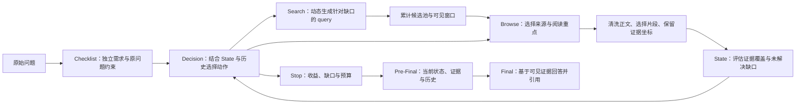
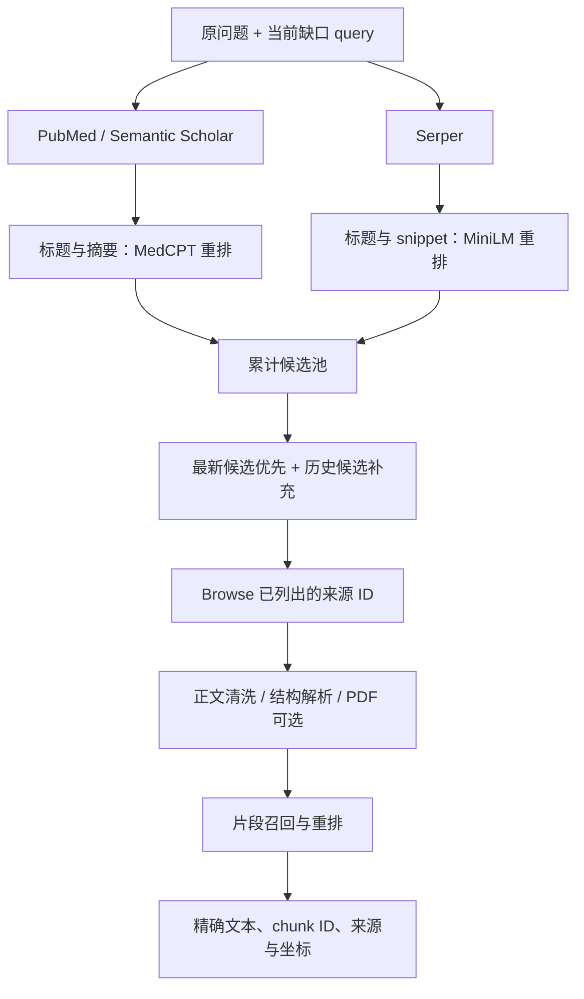

# 医学研究智能体 · Medical Research Agent

面向医学文献与网页资料的证据检索智能体。系统把问题拆成可独立核验的需求，围绕当前证据缺口动态搜索、读取来源、更新状态，再把可追溯的证据交给答案生成环节。

项目关注的不只是“搜到一个相关标题”，而是 **读到了什么、解决了哪个需求、还有什么没有证实**。用于研究，不替代临床判断。

## Base 模型与角色

本仓库的 **Base** 指没有加载本项目训练 adapter 的 **`Qwen/Qwen3-8B`**。该公开 checkpoint 已包含预训练和后训练，不是一个名为 `Qwen3-8B-Base` 的纯预训练模型。它是8.2B参数的 dense causal LM，36层，支持 thinking / non-thinking；原生上下文32,768，但本项目固定使用10,240 tokens。型号与原生能力见 [官方模型卡](https://huggingface.co/Qwen/Qwen3-8B)。

| 实验角色 | 模型与参数状态 |
|---|---|
| Base Process | Qwen3-8B，无项目 LoRA；执行 Checklist / Decision / State / Stop |
| Base Final | 同一 Qwen3-8B，无项目 LoRA；冻结后综合 Pre-Final，不是更大的替代模型 |
| 单 LoRA SFT | Qwen3-8B + 一套全链路 LoRA |
| Process-SFT | Qwen3-8B + 独立 Process LoRA；不训练 Final target |
| Final-SFT | Qwen3-8B + 独立 Final LoRA；只训练证据到答案的 completion |
| Teacher / Grader | Codex CLI teacher 与 Qwen3.7-Max grader 是外部角色，不属于上述 Base 对照 |

SFT 使用 NF4 QLoRA、BF16 compute、FP32 LoRA；在线 Process 与 Final 的实际加载精度、thinking及采样配置分别登记，不能只凭模型名称认定数值路径相同。文档统一称 Base；历史配置中的 `raw` profile、JSON键与文件名保留，确保旧结果可复现。

## 整体流程



## 两条检索链路

论文和网页共用工具协议、候选池与证据交接，但使用适合各自内容的检索和正文处理路径。

| 环节 | 论文 | 网页 |
|---|---|---|
| 来源发现 | PubMed 与 Semantic Scholar | Serper 网页搜索 |
| Search 返回内容 | 标题、摘要及来源元数据；摘要不等于全文 | 标题、snippet 与 URL；预览不等于已读正文 |
| Search 语义排序 | MedCPT Cross-Encoder | MiniLM Cross-Encoder |
| 排序关注点 | 原问题 0.7 + 当前 query 0.3 | 原问题 0.7 + 当前 query 0.3；权威性不覆盖相关性 |
| Browse | 按可用来源读取摘要、正文或 PDF；访问失败有明确回执 | 访问探针、网页正文提取与结构清洗 |
| 片段选择 | 医学片段检索、语义重排、表格结构保留 | 正文清洗后混合召回与语义重排 |

语义模型不可用时，Search 模块保留原有可用排序并记录降级，不把模型加载失败伪装成“没有相关证据”。PDF 解析属于可选正文路径，不承诺每篇论文都能取得全文。



## 候选池：保留历史，不覆盖最新结果

当前可见窗口最多 **8 个候选**。首次搜索沿 Search 后端的返回顺序填充；之后最多先放 4 个最新候选，剩余位置从历史池按原问题的 MiniLM 相关性选择。历史不足时，用更多最新候选补齐。

**最新候选在前，历史候选在后，不再进行合并后的全局重排。** 因此 Search 已完成的语义排序不会被第二次混合排序打乱。候选池保存累计来源，可见窗口只是当前给模型看的投影；记录包含分组、显示顺序和来源 ID。

## Checklist、State 与动态 Query

- Checklist 从原问题提取可独立回答的需求，保留人群、疾病、干预、时间等共享约束；不会机械地把所有关键词拆成任务。
- Decision 看原问题、当前 State、历史和候选，针对具体缺口生成 query。论文允许医学关键词或 Boolean 检索式，网页允许聚焦短语；不强制英文完整句子。
- Prompt 要求不引入无关疾病、药物、年份或研究类型；这些是模型指导，不是后端已经证明的语义硬约束。
- Browse 只允许使用当前列出的来源 ID。标题相关不等于证据支持；导航、登录、广告和访问错误不能用于提升覆盖状态。
- State 依据已读证据更新 `unknown / partial / direct` 与证据 ID。`direct` 是模型评估，仍可因证据不足或冲突而修订。

工具接口保持不变：没有为了 query 聚焦新增必填的 requirement-ID 字段。英文 Prompt 源码见 [Decision](retrieval/runtime/sft_interface_v20.py)、[Checklist](retrieval/runtime/checklist_feedback_v55.py) 和 [State](retrieval/runtime/state_compact_v38.py)。

## 历史、预算和失败处理

历史是固定预算下的工作记忆，保存已发生的动作、工具结果摘要和状态变化；证据正文单独交接。历史不能引用未来阶段，也不能把失败尝试标成成功。最终状态以最新有效 State 为准。

当前阶段合同：总上下文 **10,240 tokens**；Checklist、State 各预留 1,200，Decision/Stop 各 240，Final 2,400。不会为了塞入历史单独放宽某一阶段。

工具预算按执行回执结算：**6 次计费动作 + 最多 3 次环境失败豁免，最多 9 次真实工具执行**。空搜索、无相关内容和非法参数不是环境失败豁免。3 次豁免用尽不直接强制 Stop，后续动作继续按正常预算结算。Browse 同时遵守来源黑名单、冷却与失败重试限制。

## 证据交接与引用

Pre-Final 不是另写一份自由摘要，而是按实际 Final 输入合同导出：问题、最新 State、Checklist freshness、已打开证据、来源头信息，以及共享输入构建器实际保留的历史。原始轨迹与输入包分别保存，便于复查。

证据 freshness 用 **精确 chunk ID 与文本** 计算，避免仅因展示元数据变化误判状态过期。Evidence Card 是长证据的预算内交接机制，不替代原始出处。

当前独立 Final 接口使用短引用别名，并保留到原始 chunk ID 的确定性映射；输出为单个 `<answer>...</answer>`。引用存在、格式正确与“该句确被证据支持”分别检查，不能互相替代。见 [引用与 Final 合同](docs/final_contract.md)。

## 源码与阅读入口

| 目录 / 文档 | 内容 |
|---|---|
| [retrieval/](retrieval/README.md) | 当前论文、网页、PDF、清洗与语义排序源码 |
| [retrieval/runtime/](retrieval/runtime/README.md) | 当前候选窗口、英文 Prompt、失败预算与证据交接组件 |
| [系统架构](docs/architecture.md) | 模块边界与证据生命周期 |
| [检索设计](docs/retrieval.md) | Search / Browse 与候选池细节 |
| [代码导航](docs/code_navigation.md) | 按功能定位实际源码 |
| [API 配置](docs/apis.md) | 服务用途与变量名；不含真实密钥 |
| [Codex CLI 轨迹采集](docs/codex_cli_collection.md) | Teacher 如何通过项目真实工具生成阶段轨迹与历史 |

## 项目迭代

首页描述当前检索与工程机制；实验方法、参数和结果按版本分开维护，不混用旧检索与新检索的实验结论。

| 版本 | 独立说明 | 检索代码 |
|---|---|---|
| 单 LoRA | [全链路单 LoRA：设计、训练与评测](versions/single_lora/README.md) | [冻结的旧检索](versions/legacy_retrieval/README.md) |
| 双 LoRA | [双 LoRA：迭代动机与实验框架](versions/dual_lora/README.md) | 与单 LoRA 共用冻结旧检索 |
| Process-SFT + Final-SFT | [Process / Final 解耦：采集、训练与消融](versions/process_final_sft/README.md) | 当前检索 |

版本目录明确区分已经执行的训练与待执行的研究计划。公开内容仅包含代码、合同、配置和方法说明，不包含私有训练题、完整采集记录、金标答案、模型权重或凭据。

## SFT 的共同输入合同与版本差异

一条完整工具轨迹拆成多个阶段样本：**阶段开始时真实可见的输入 → 当前阶段 teacher completion**。输入包含原题、预算内因果历史、最新有效 State、候选及可见证据；历史并非另一条需要生成的 target。只对当前 completion 计算 next-token CE，问题、Prompt、历史、工具 Observation 和证据不计 loss。被 Runtime 拒绝的错误输出保留溯源，但不自动作为正监督。

共同的是 completion-only 和真实输入合同，**loss 归一化不是三个版本完全相同**：单 LoRA 采用样本内 target-token mean 后按样本权重聚合；Process700采用加权 target-token 总量口径；独立 Final采用 effective batch 内有效 target-token mean。各版本分别说明阶段保留、权重及计算方式，不跨口径比较 loss 高低。

“没有固定最终答案金标”不等于“没有监督”：Process 使用 teacher 的 Checklist、工具动作和 State 等阶段目标；独立 Final 使用按实际 Pre-Final 审核的 gold answer。HealthBench 又有官方 rubric，不能称为无评测标准的题集。

共同的LoRA参数化为：

```math
W_{\mathrm{eff}}=W_0+\frac{\alpha}{r}BA,\qquad
W_0\ \text{frozen},\quad A,B\ \text{trainable}.
```

其中 $r$ 为adapter rank，$A$、$B$ 为低秩矩阵。当前completion的监督mask为 $m_{it}$：target为1，其余为0。共同CE项为：

```math
\ell_{it}=-m_{it}\log\pi_\theta(y_{it}\mid x_i,y_{i,<t}).
```

如何聚合这些CE项，以及阶段权重、GRPO优势与策略目标，分别见[单LoRA公式](versions/single_lora/README.md#sft与grpo公式)、[双LoRA计划公式](versions/dual_lora/README.md#计划算法与公式)、[Process与Final公式](versions/process_final_sft/README.md)、[Process-GRPO公式](versions/process_final_sft/grpo.md#计划目标函数与算法)。

当前版本采用700题最新工程重新采集的Process轨迹与历史；Process采用38题开发对照，Final训练6轮并保留六个checkpoint，38题六checkpoint对照待测。阅读[Process与Final训练公式](versions/process_final_sft/README.md)、[20题四组与双轨评测](versions/process_final_sft/evaluation.md)、[Process-only GRPO计划与公式](versions/process_final_sft/grpo.md)。各版本单独定义loss归一化与策略更新，不混入旧开发测试记录。

Apache-2.0；必要署名见 [第三方声明](THIRD_PARTY_NOTICES.md)。模型与外部服务另受各自条款约束。
