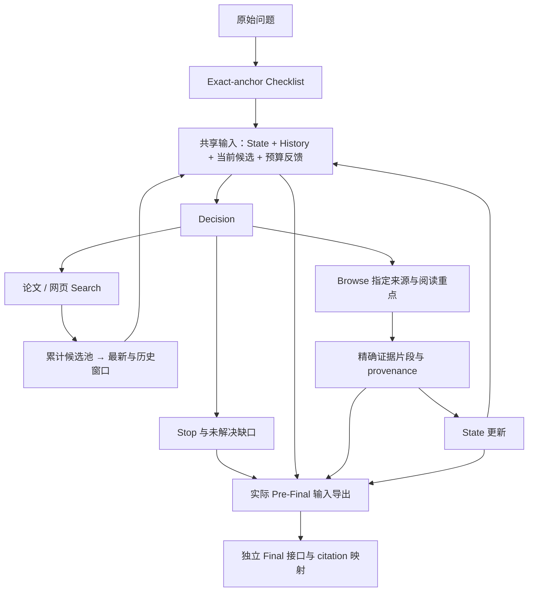

# 当前工程架构

[首页](../README.md) · [检索机制](retrieval.md) · [版本入口](../README.md#项目迭代)

## 模块边界

工具层发现、获取与整理内容，不替模型修改问题范围。策略层选择当前缺口和动作；State 是已读证据的覆盖评估，不是搜索候选的质量标签。Final 基于实际可引用文本综合，不能从 State 的 direct 标签推出未见事实。

## 三类 ID

来源 ID 用于选择 Browse；chunk ID 标识实际证据；Final 的 E 别名只为输出压缩，确定性映射到 chunk。不要把三类 ID 混作同一类。来源候选出现过，不代表其正文已读或允许引用。

## 状态与证据交接

证据正文和历史过程摘要分别保存。重新读取返回相同 chunk 不计为新增证据。State 更新后的状态被下一步实际输入继承；历史选择不得留下未经标记的过时状态来覆盖新状态。

`evidence_freshness_v57.snapshot` 根据精确 chunk ID/text 判断对应关系；旧展示摘要 hash 不可替代。Pre-Final 应导出共享 builder 实际准备的消息与 token 预算，而不是从轨迹手写近似输入。

## 防护边界

后端校验动作格式、候选 ID、预算和执行记录；Prompt 指导 query 与需求对齐，但不保证语义正确。工具正文视为不可信输入，不执行其中指令。医学支持、范围和引用绑定需独立语义检查。

本页描述当前工程组件；旧共享策略架构完整保留在 [历史架构](../versions/single_lora/architecture.md)，训练策略见各版本，不在工程层绑定某个训练方法。
