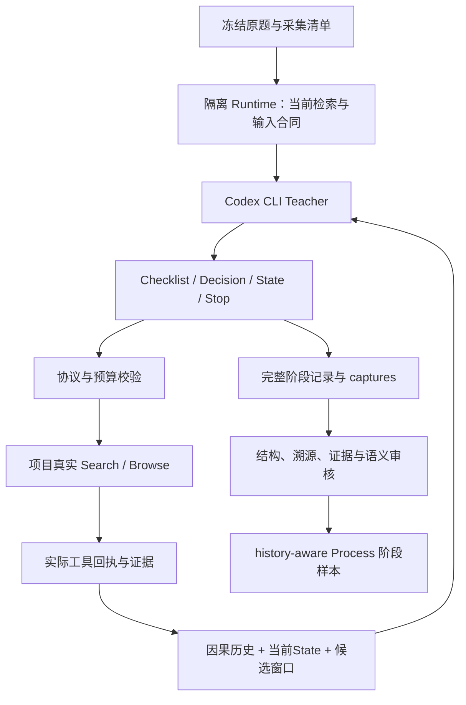

# Codex CLI 如何采集 Teacher 轨迹

[返回首页](../README.md) · [Process / Final 版本](../versions/process_final_sft/README.md)

## Teacher 与工具的分工

Codex CLI 负责提出阶段输出和下一步动作；项目Runtime负责执行真实检索工具、校验动作、打包输入和记录结果。不是让Teacher在网页外自行搜索，再把答案拼成轨迹。

## 两批 CLI 采集与数据归属

早期已有百余题的Codex CLI真实工具采集；当前Process版本为700题按最新工程重新采集。两组都遵守“CLI提出动作、项目工具执行、保存原始回执”的边界，各自登记题目清单与工程身份。

| 批次 | 规模与定位 | 工程归属 |
|---|---|---|
| 早期CLI采集 | 百余题；早期teacher阶段记录 | 使用当时冻结的检索、Prompt与阶段合同 |
| 最新Process采集 | 700题；原训练题重新采集轨迹与历史 | 使用最新检索工程、Prompt与阶段合同 |

当前Process版本统一采用700题新采集轨迹；不在该版本说明中混入旧数据组合。每批采集与训练由各自清单关联，不用历史训练步数代替新批次验收。

两批采集都使用各自冻结时的检索源码与英文阶段合同。后续变更检索、Prompt或失败预算，须记录新源码身份；不能把旧批次回执改写成在最新版工程上执行过。

## 逐题执行

1. 冻结原题集合、源码身份、模型配置、阶段预算和工具依赖。700题从已有训练题中选择，不新造问题；训练/验证集合分别登记。
2. 每题建立独立运行记录与缓存身份，使用最新英文Process Prompt、论文/网页后端、候选窗口和失败预算。
3. Teacher每次只产生当前阶段输出。工具动作经Runtime校验后执行；回执进入下一阶段输入，Teacher不能写入未发生的Observation。
4. 保存输入、原始输出、执行参数、拒绝/失败反馈、证据及State修订。格式错误的拒绝尝试保留在记录中，但不作为合格正监督；修复动作必须真实执行。
5. 当前Process-only采集截止于Final前，不生成Final训练目标；早期全链路记录按其原合同保存，不混入当前Process目标。历史只包含此前已发生事件，不能泄漏未来State、Final或评分标签。
6. 审核后将各阶段拆成step-wise样本，只监督当前completion。完整轨迹保留用于溯源，不因训练按步拆分而丢失上下文。

## 历史与 Pre-Final 的区别

Teacher轨迹的历史支持Process SFT。后续训练好的Process模型真实跑题，由共享输入构建器自动导出其实际Pre-Final，再用于Final金标与Final-SFT。两者不是把同一个teacher Final直接搬过去。

导出实现见 [export_prefinal.py](../versions/process_final_sft/process/export_prefinal.py)，历史实现见 [process_history_v1.py](../retrieval/runtime/process_history_v1.py)。长证据卡片沿用实际Runtime机制；未缓存卡片若需要模型调用，必须显式授权并记录。

## 验收与复现

工程验收检查：原题身份、source ID、工具参数与回执、因果顺序、State传递、固定阶段预算、历史与capture溯源。语义审核另看query范围、证据是否有用、State覆盖是否得到实际文本支持。结构通过不代替语义正确。

重试保留原失败与新attempt，不覆盖记录；完整trajectory重启与单工具内部transport重试分别登记。并行worker使用独立运行目录，并遵守服务限流。CLI若未暴露seed/temperature控制，就记录为不可用，不声称已固定。

公开仓库提供检索和合同组件、训练与导出源码，不附私有题集、CLI登录凭据或集群专用采集启动器。具体运行清单与验收记录由私有实验包保存；本说明不替代完成清单。
