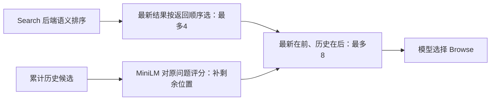

# 当前检索设计

## Search 与 Browse 是两个动作

Search 发现带预览的来源；Browse 对已列出的 source ID 读取内容。论文 Search 的摘要可用于判断阅读优先级，不将未读取候选自动写入已打开证据。Browse 的 query 是阅读重点，不是用于选择另一个来源的 ID。

论文 Search 并行查询 PubMed 与 Semantic Scholar，并合并候选；MedCPT 在标题/摘要上按原问题与当前 query 重排。PubMed 保留原查询优先，在必要时使用保守关键词回退，不保证自然语言长句总优于关键词。

网页 Search 使用 Serper，再基于标题/snippet 做 MiniLM 重排。原问题权重0.7、当前 query0.3；领域权威性和原有顺序只作相关性相近时的辅助。来源权威不等于本题相关。

## 两级排序，不做最后混排

首次无历史时，最新结果可填满8；新结果少时历史补更多，历史少时剩余新结果补齐。相同来源去重；没有可读预览的候选不进入该窗口。8个窗口不是池大小，也不是要求模型按排名强制逐个打开。

## Browse 与片段

访问探针帮助区分可达与明显受限来源，但可达不保证正文有信息。清洗模块处理菜单、引用区、广告与非正文结构；正文解析保留章节、表格和坐标。医学/混合片段检索用 query 选出实际返回窗口，保留精确文本与 provenance；来源清洗规则不是为某一个测试题特制的答案选择器。

若全文或PDF不可读，明确返回失败或实际取得的可用内容，不冒称读取成功。semantic模型、PDF解析和网络失败分开记录，空搜索或无相关正文不能自动获得环境失败豁免。

## 预算与历史

正常工具预算6；明确环境失败最多3次豁免；实际执行最多9。失败来源遵守黑名单与重试规则。相同来源相同已成功阅读 query 的重复保护与工具结算并存，不以无限重试消耗系统资源。

共享阶段输入在10,240 context和固定reserve内打包。过程历史用于保留搜索、状态修订与失败恢复；长证据由Evidence Card或原始可引用chunk交接。预算裁剪不能把后续State修订省略后，仍把旧状态展示成最新事实。

相关源码见 [检索目录](../retrieval/README.md) 与 [Runtime组件](../retrieval/runtime/README.md)。历史单 LoRA 的检索说明保留在 [旧检索文档](../versions/single_lora/retrieval.md)，不再作为当前配置说明。
