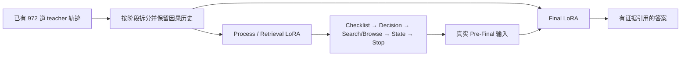

# 版本二：双 LoRA 框架

[返回项目首页](../../README.md) · [历史单 LoRA](../single_lora/README.md) · [后续 Process / Final](../process_final_sft/README.md)

本页定义复用已有 **972 道 teacher 轨迹** 的双角色重训方案，不重新采集。972 指该轮清洗后的轨迹集合，不把早期说明中的 974 原始训练题数量混为同一个数据版本。新的 972 题双 LoRA 重训与配对 50 题结果尚待执行。

## 角色与数据

- 两套 adapter 共享 Qwen3-8B frozen base，参数与优化器分别管理；不在同一个正在更新的 adapter 上仅屏蔽 Final loss 就声称 Final 已冻结。
- Process 学 Checklist、具体 Search/Browse 动作、State 和 Stop；Final 学实际证据输入到答案。输入侧的历史、状态、工具结果不参与 target loss。
- 先使用已有 teacher 的阶段记录建立基线。teacher Pre-Final 与真实 Process 产生的输入有分布差异；后续 on-policy Pre-Final 适配属于下一版本，不回填成本版本已经完成。
- 切换 adapter 必须重新构建输入与 prefill，不能复用另一个 adapter 的 KV cache。
- 单 LoRA 与本版本共用 [冻结旧检索](../legacy_retrieval/README.md)，保持同一历史工具、预算和 citation 合同，避免同时改模型与检索造成归因混乱。

## 初始参数与验收

先采用 Qwen3-8B、fresh LoRA、completion-only CE、microbatch 1、accum 8、r32 / alpha64 / dropout0.05。训练步数必须按拆分后实际样本数计算，不能直接沿用旧全链路更新数。学习率、epoch 和两角色数据量在执行前冻结，本框架不冒称已采用某个新配置。

验收包括阶段 mask、无未来历史、State→下一输入一致、证据 ID 可见、最长样本前反向、参数确有更新、checkpoint 完整性以及新进程续跑。旧共享 LoRA 的训练源码保留在 [sft/](../../sft/) 与 [training/](../../training/)；不能把其中“shared LoRA”入口直接称为完成了双 adapter 训练。

## 同 50 题验证

比较 Raw、旧单 LoRA SFT、新双 LoRA，固定题目、工具后端、预算、seed、温度和评分协议；同时记录流程失败和有效配对。历史结果留在单 LoRA 页面，不替代本轮结果。

既看完整答案，也分开核查 query、真实获取的证据、State 覆盖和 Final 证据绑定。若完整答案与检索指标不一致，报告差异，不据此单独宣称“模型更好”。50 题若已用于调参，应称开发验证集，不再视为未触碰的最终测试集。
