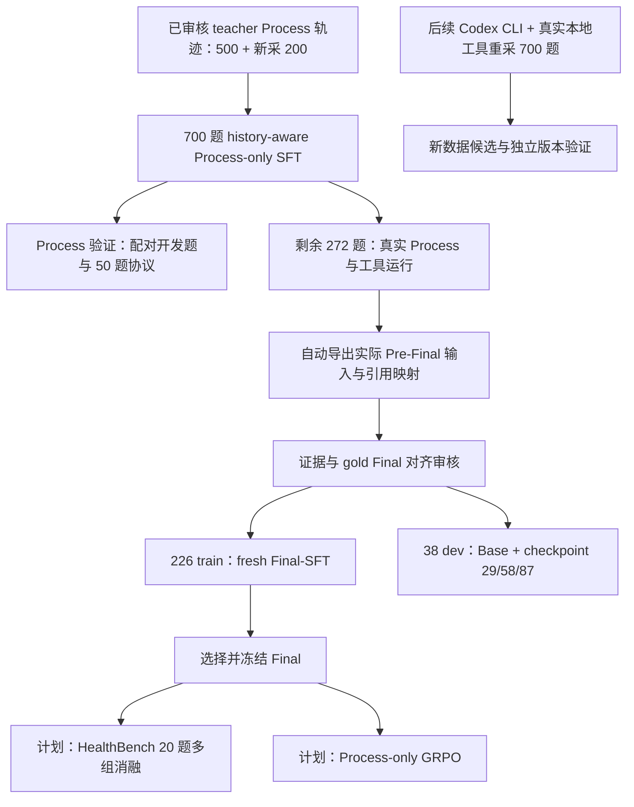

# 版本三：Process-SFT + Final-SFT

[返回首页](../../README.md) · [双 LoRA 框架](../dual_lora/README.md) · [评测与消融](evaluation.md)

目标是拆开 **证据获取/状态构建** 与 **证据到答案的综合**，让后续优化可以区分问题来自 Process 还是 Final。使用当前检索工程，不继承旧全链路 adapter 来初始化 fresh Process 或 fresh Final。

## 路线与实际执行范围

已执行的训练：Process 700 题 / 6,741 条阶段样本 / 843 updates；Final 226 题 / 3 epochs / 87 updates。272 题是采集任务规模，不等于全部通过训练审核；226 train + 38 dev 是进入本轮 Final 数据合同的集合，其他记录不自动补进训练。

700 题由先前筛选的 500 与新采 200 组成，集合互不重叠。之后用 Codex CLI 和真实本地工具重新生成 700 道 teacher Process 轨迹是 **后续计划**，保留失败与修复过程，不把未执行动作包装成有效监督。

## Process 训练

| 参数 | 实际配置 |
|---|---|
| Backbone / 初始化 | Qwen3-8B，fresh Process LoRA |
| 数据 / target | 700 题 / 6,741 rows；Checklist、Decision（含具体 tool call）、State、Stop；Final targets=0 |
| History | runtime 一致、固定阶段预算；历史与证据仅作输入 |
| Epoch / updates | 1 / 843；末尾不足 8 条单独结算 |
| QLoRA | NF4 double quant；BF16 compute；FP32 LoRA；不调用 k-bit prepare |
| LoRA | r32、alpha64、dropout0.05 |
| LR / batch | 1e-4；microbatch1；accum8 |
| Optimizer / attention | AdamW；deterministic Flash |
| 上下文 | 10,240；Checklist/State reserve1,200；Decision/Stop240 |
| Loss | completion-only、阶段加权 target-token 口径；不与 Final loss 数值直接比较 |

实际训练源码：[process/train.py](process/train.py)、[core.py](process/core.py)、[process_checks.py](process/process_checks.py)。保留原训练算法和可断点 checkpoint 验证；私有数据与审核回执不公开，所以源码不是免数据一键开跑包。实际 scheduler 是5% warmup乘以cosine因子，以代码为准，不冒称与 Final 的分段 scheduler 完全相同。

## Pre-Final 与 Final 训练

Process 冻结后真实跑题，自动保存完整轨迹、captures 和实际 Final 输入。导出实现见 [export_prefinal.py](process/export_prefinal.py)，因果历史见 [process_history_v1.py](../../retrieval/runtime/process_history_v1.py)。导出器的 `--live` 应指向部署时完整的共享 Runtime（含 alignment/budget/packing 依赖），不是本仓库的组件摘录；默认不调用模型，未缓存卡片需要另行明确授权。Final target 只能由该输入中的证据支持，不能照搬包含缺失证据的 teacher 答案；State 标签与文字若有错误，Final 应检查实际证据而不是机械信任 `direct`。

| 参数 | 实际配置 |
|---|---|
| Backbone / 初始化 | 同一 Qwen3-8B base，fresh Final LoRA |
| 数据 | 226 train；38 dev，与 train 不重叠 |
| Epoch / updates | 3 / 87；每 epoch29；checkpoint29、58、87 |
| LR / warmup | 5e-5 / 5 updates |
| Optimizer / scheduler | AdamW，weight decay0.01，cosine_after_warmup，clip1.0 |
| LoRA / precision | r32 / alpha64 / dropout0.05；NF4 double quant + BF16 compute + FP32 LoRA |
| Batch / seed | microbatch1、accum8、seed42 |
| Loss | valid target-token mean per effective batch；只监督当前 Final completion |
| 输入 / 输出 | 实际冻结 Pre-Final；短 citation 别名；单个 answer envelope |
| 预算 | context10,240；Final reserve2,400 |

源码：[final/train_final.py](final/train_final.py)、[training_core.py](final/training_core.py)、[TRAIN_CONFIG.json](final/TRAIN_CONFIG.json)。保存 weights、optimizer、scheduler、RNG、数据位置与身份；CPU/GPU mask/update/resume 验收不等于医学质量通过。

38 dev 使用相同 Pre-Final 分别生成 Base 与三个 checkpoint 的答案，共152个；这是 **固定输入 Final 对照**，不是重新跑 Process 的端到端对照。生成温度与采样参数是推理设置，SFT 的 teacher-forced CE 本身没有“温度1训练”。模型选择依据 dev 证据支持与答案质量，不只看训练 loss。

## 后续验证与 GRPO

先完成 [20 题消融与双轨评测](evaluation.md)，再决定是否进入 GRPO。50 题仍用于 Process 开发验证，20 题专门冻结多组对照；曾参与调参的题不能重新宣称独立测试。

GRPO 期间 Process adapter 可训练，Final adapter 固定；Final 提供固定下游生成，不参与策略 token replay。rollout 与 replay 的 base 精度、adapter snapshot、模板与行为概率口径必须一致。SFT 的 QLoRA 权重可以作为初始化，但不能自动沿用 NF4 replay 与 BF16 rollout 的不匹配组合。

上线前需短/长样本 logprob parity、组内 reward、失败预算、重新 prefill 和 checkpoint 续跑验收。GRPO 属于计划，不把已有离线工程测试表述成完整 RL 训练效果。
