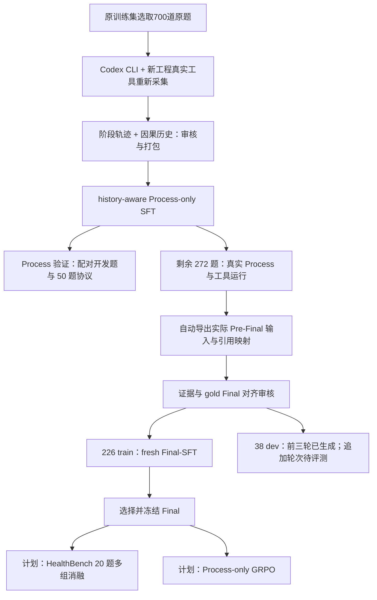

# 版本三：Process-SFT + Final-SFT

[返回首页](../../README.md) · [双 LoRA 框架](../dual_lora/README.md) · [评测与消融](evaluation.md)

目标是拆开 **证据获取/状态构建** 与 **证据到答案的综合**，让后续优化可以区分问题来自 Process 还是 Final。使用当前检索工程，不继承旧全链路 adapter 来初始化 fresh Process 或 fresh Final。

## 迭代原因

独立 adapter 还不足以解决输入分布差异：teacher 的理想证据包与实际 Process 能找到的信息可能不同。这个版本让 Process 先真实执行工具，再自动导出实际 Pre-Final，Final 的金标和训练以这些可见证据为依据；随后冻结 Final，单独研究 Process 的改进。检索工程同时更新，因此新轨迹须按同一工程合同采集。

## 本版本采集与训练路线

本版本的700题均取自原训练题，不是重新编写题目；按更新后的工程，使用 **Codex CLI teacher 和项目真实本地工具重新采集700题的Process轨迹与历史**，随后审核、构建Process-only SFT。采集方法见 [Codex CLI 说明](../../docs/codex_cli_collection.md)。这条完整重采路线的完成情况以独立采集清单为准，不用此前训练的更新数代替采集验收。

已有训练运行参考：此前700题包采用500条保留轨迹与200条新采轨迹，得到6,741条阶段样本和843 updates；已有Final运行是226题、3 epochs、87 updates。下面保留这些实际训练代码和配置作为重采后重训的参考，新轨迹的样本数与步数须重新计算。272题是实际Process采集任务规模；226 train + 38 dev 是进入已有Final数据合同的集合，其他记录不自动补进训练。

## 已有 Process 训练代码与参数参考

| 参数 | 已有运行配置；新重采数据待重新冻结 |
|---|---|
| Backbone / 初始化 | Qwen3-8B，fresh Process LoRA |
| 数据 / target | 700 题 / 6,741 rows；Checklist、Decision（含具体 tool call）、State、Stop；Final targets=0 |
| History | runtime 一致、固定阶段预算；历史与证据仅作输入 |
| Epoch / updates | 1 / 843；末尾不足 8 条单独结算 |
| QLoRA | NF4 double quant；BF16 compute；FP32 LoRA；不调用 k-bit prepare |
| LoRA | r32、alpha64、dropout0.05 |
| LR / batch | 1e-4；microbatch1；accum8 |
| Optimizer / attention | AdamW；deterministic Flash |
| 上下文 | 10,240；Checklist/State reserve1,200；Decision/Stop240 |
| Loss | completion-only、阶段加权 target-token 口径；不与 Final loss 数值直接比较 |

实际训练源码：[process/train.py](process/train.py)、[core.py](process/core.py)、[process_checks.py](process/process_checks.py)。保留原训练算法和可断点 checkpoint 验证；私有数据与审核回执不公开，所以源码不是免数据一键开跑包。实际 scheduler 是5% warmup乘以cosine因子，以代码为准，不冒称与 Final 的分段 scheduler 完全相同。

### Process 的阶段拆分与 loss

保留Checklist初始化/有效修正、具体Search/Browse决策、State更新与Stop；Final不进入监督目标，也不得混入更早阶段的历史。每条样本只保留该阶段已经可见的内容，拒绝尝试的反馈可以进入后续输入，但拒绝输出不自动进入合格target。

实现对每个 `target_span` 求CE总和并乘该span权重。设某数据流总加权target-token量为M、全部样本数为N、数据流份额为p，则缩放系数为 `N*p/M`；batch中各样本的加权CE总和乘此系数后按实际batch样本数归一化。仅step-wise训练时p=1；阶段影响取决于target长度和span权重，不是每个阶段天然各占相同loss份额。最后不足8条的batch按实际大小结算。

## 已执行的开发实验

这两类开发测试用于定位能力与选择checkpoint，不能当作后续正式四组测试的结果。

| 开发实验 | 已执行内容 | 作用 |
|---|---|---|
| Process | Process700完成1轮、843更新；10题Base/SFT配对真实工具轨迹 | 对比Checklist、Query、已读证据、State和工程行为 |
| Final | 固定38题Pre-Final；Base与checkpoint29/58/87，共152答案 | 隔离答案综合与引用能力；不重跑检索 |

早期10题过程审核中，已读证据信息偏好为 **SFT胜5、平3、Base胜2**。该结论来自原题和真实已读文本的开发审核，不是医学专家认证或HealthBench分数。SFT更常根据缺口继续Search，出现更广的知识来源和补充内容，也更遵守工具协议：10题累计Search为24次，Base为10次；Runtime拒绝事件SFT为3、Base为26。SFT的终止记录为7次工具预算耗尽、3次policy ready；Base为6次无效下一动作、4次decision-turn guard。

因此，已观察到的SFT优势是 **多轮缺口补证与工程格式**，不只是重复teacher答案。Base在该批次每题只有一次Search，后续较多重复/无效动作，容易没有及时补充缺口；但部分题Base读到了更对题的核心研究，不能把“更多来源”直接当成“更高质量”。SFT也有访问失败、Query范围漂移、State高估及证据终点错绑，不能由过程优势推出Final必然更好。

后续同配置Query-focus开发实验仍保留完整结论：v1只有8对完成，Base/SFT最终rubric均分为30.19%/20.55%；v2只有9对完成，为22.76%/18.76%，SFT4胜、Base4胜、1平。它们使用同一个冻结Base Final和Qwen3.7-Max替代grader；样本与完成对数不同，不把均值变化单独归因于Prompt，也不声称SFT整体超过Base。**过程改善与最终任务得分分别报告。**

## Pre-Final 与 Final 训练

Process 冻结后真实跑题，自动保存完整轨迹、captures 和实际 Final 输入。导出实现见 [export_prefinal.py](process/export_prefinal.py)，因果历史见 [process_history_v1.py](../../retrieval/runtime/process_history_v1.py)。导出器的 `--live` 应指向部署时完整的共享 Runtime（含 alignment/budget/packing 依赖），不是本仓库的组件摘录；默认不调用模型，未缓存卡片需要另行明确授权。Final target 只能由该输入中的证据支持，不能照搬包含缺失证据的 teacher 答案；State 标签与文字若有错误，Final 应检查实际证据而不是机械信任 `direct`。

| 参数 | 实际配置 |
|---|---|
| Backbone / 初始化 | 同一 Qwen3-8B base，fresh Final LoRA |
| 数据 | 226 train；38 dev，与 train 不重叠 |
| Epoch / updates | 3 / 87；每 epoch29；checkpoint29、58、87 |
| LR / warmup | 5e-5 / 5 updates |
| Optimizer / scheduler | AdamW，weight decay0.01，cosine_after_warmup，clip1.0 |
| LoRA / precision | r32 / alpha64 / dropout0.05；NF4 double quant + BF16 compute + FP32 LoRA |
| Batch / seed | microbatch1、accum8、seed42 |
| Loss | valid target-token mean per effective batch；只监督当前 Final completion |
| 输入 / 输出 | 实际冻结 Pre-Final；短 citation 别名；单个 answer envelope |
| 预算 | context10,240；Final reserve2,400 |

源码：[final/train_final.py](final/train_final.py)、[training_core.py](final/training_core.py)、[TRAIN_CONFIG.json](final/TRAIN_CONFIG.json)。保存 weights、optimizer、scheduler、RNG、数据位置与身份；CPU/GPU mask/update/resume 验收不等于医学质量通过。

38 dev 使用相同 Pre-Final 分别生成 Base 与三个 checkpoint 的答案，共152个；这是 **固定输入 Final 对照**，不是重新跑 Process 的端到端对照。生成温度与采样参数是推理设置，SFT 的 teacher-forced CE 本身没有“温度1训练”。模型选择依据 dev 证据支持与答案质量，不只看训练 loss。

### 追加三轮方案与当前状态

已确认完成的是3 epochs / 87 updates。追加3轮后总计6 epochs / 174 updates；新增epoch-end checkpoint预计为116、145、174，**追加训练与这些checkpoint的38题评测尚未验收**。不能把现有152答案当成六轮的结果。每轮29步基于226题、accum8，数据量变更时重新计算。

续训应从checkpoint87的Final adapter继承，不继承Process adapter。是否恢复optimizer、如何续接或重设scheduler及追加学习率须在新配置中明确冻结；把 `epochs` 改成6并不自动等于原87步scheduler无缝延长。当前公开 `TRAIN_CONFIG.json` 保持已跑3轮的真实配置，不覆盖历史身份。

Final loss 对effective batch内所有有效target token求CE总和，除以该batch的有效target-token总数；输入和证据不监督。训练金标逐句以实际Pre-Final为边界，短citation别名由确定性映射还原；引用合法和句子得到证据支持分别审核。追加轮次不自动改善质量，先比较38 dev后选择冻结checkpoint。

## 后续验证与 GRPO

先完成 [20 题消融与双轨评测](evaluation.md)，再决定是否进入 GRPO。50 题仍用于 Process 开发验证，20 题专门冻结多组对照；曾参与调参的题不能重新宣称独立测试。

GRPO 期间 Process adapter 可训练，Final adapter 固定；Final 提供固定下游生成，不参与策略 token replay。rollout 与 replay 的 base 精度、adapter snapshot、模板与行为概率口径必须一致。SFT 的 QLoRA 权重可以作为初始化，但不能自动沿用 NF4 replay 与 BF16 rollout 的不匹配组合。完整准备、奖励与验收见 [Process-only GRPO 计划](grpo.md)。

上线前需短/长样本 logprob parity、组内 reward、失败预算、重新 prefill 和 checkpoint 续跑验收。GRPO 属于计划，不把已有离线工程测试表述成完整 RL 训练效果。
