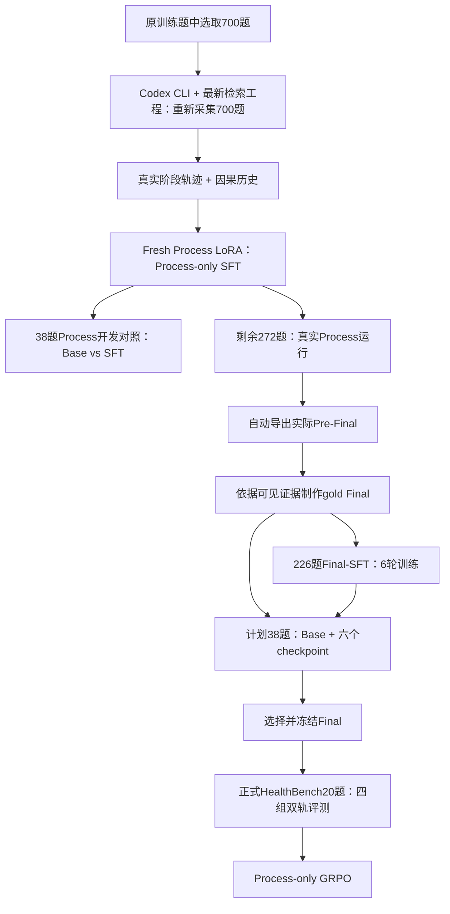

# 版本三：Process-SFT + Final-SFT

[返回首页](../../README.md) · [评测与四组消融](evaluation.md) · [GRPO算法计划](grpo.md)

本版本将证据获取与答案综合解耦：Process负责Checklist、动态Search/Browse、State与Stop；Final只负责根据实际Pre-Final生成有证据支持的答案。两者共享Qwen3-8B backbone，但使用独立LoRA，不从旧全链路adapter初始化。

## 迭代原因

统一学习工具决策与长答案，难以区分错误来自证据获取还是答案综合。本版本分别训练、分别开发验证，再在同一正式benchmark上组合比较；GRPO阶段冻结Final，只优化Process。

## 数据与训练路线



700道题均来自原训练题，按最新工程使用Codex CLI和项目真实工具重新采集Process轨迹与历史。本页只描述这一版700题新采集路线，不混入旧数据组合和旧测试批次。见[采集方法](../../docs/codex_cli_collection.md)。

Process冻结后，对未进入这700题训练的剩余272题运行真实工具并自动导出Pre-Final。通过输入与证据审核后，Final使用226题训练、38题开发；38题与226题互不重叠。272是采集范围，不意味着所有记录都自动进入Final训练。

## Process-SFT

### 轨迹拆分

一条轨迹按当前阶段拆分为：原题 + Compact History + 当前Checklist/State + 候选或已读证据 → 当前阶段completion。

- Checklist：监督独立需求与共享范围。
- Decision：监督具体Search query、Browse来源ID及阅读重点，不只监督动作类别。
- State：监督有证据来源的状态更新与未解决缺口。
- Stop：监督继续收益、剩余缺口与预算下的结束决定。
- Final：不作为Process target，不进入更早阶段历史。

输入、历史和工具Observation全部mask，仅当前合法completion计算CE。拒绝尝试保留反馈与因果记录，不自动作为合格正监督。离线与在线Runtime共用历史、证据packing和阶段预算。

### 参数

| 项目 | 配置 |
|---|---|
| Base / adapter | Qwen3-8B + fresh Process LoRA |
| 题目 | 700题，最新工程重新采集 |
| Epoch / batch | 1轮；microbatch1；accum8 |
| LoRA | r32、alpha64、dropout0.05 |
| LR / optimizer | 1e-4；AdamW；5% warmup与cosine因子 |
| 精度 / attention | NF4 double quant、BF16 compute、FP32 LoRA；deterministic Flash |
| 预算 | context10,240；Checklist/State reserve1,200；Decision/Stop240 |
| Loss | completion-only，加权target-token口径 |
| 更新步数 | 按最终阶段样本数N计算ceil(N/8)，不以题目数代替样本数 |

训练实现：[train.py](process/train.py)、[core.py](process/core.py)、[process_checks.py](process/process_checks.py)。训练入口的数据身份与固定规模gate必须与最终新采包一致，不直接沿用其他批次的样本数。

### Loss公式

设样本 $i$ 的当前target位置集合为 $T_i$，位置 $t$ 的span权重为 $w_{it}$，CE为 $\ell_{it}$。全部样本数为 $N$，总加权target-token量为 $M$：

```math
\begin{aligned}
\ell_{it} &= -\log\pi_{\theta_P}(y_{it}\mid x_i,y_{i,\lt t}), \\
M &= \sum_{i=1}^{N}\sum_{t\in T_i}w_{it}.
\end{aligned}
```

当前只有step-wise数据流，batch B的loss为：

```math
\mathcal L_P(B)=\frac{N}{|B|M}\sum_{i\in B}\sum_{t\in T_i}w_{it}\ell_{it}.
```

这是按整个epoch的加权token量固定缩放，不是每条短Decision与长State先取均值后同权；阶段影响由target长度与span权重决定。最后不足8条按实际batch大小结算。Smoke中的单条token-mean loss与正式训练口径分别记录。

### 38题Process开发对照

38题用于比较Base Process与Process-SFT真实工具轨迹。共用最新检索、英文Prompt、预算、题目和matched seed，Process温度1；审核Checklist、Query、Evidence、State、Stop与工程格式，不用Final写作差异替代Process质量。

过程观察的能力特点：

| 方面 | Base常见薄弱点 | Process-SFT的优势方向 |
|---|---|---|
| Search规划 | 单次搜索后补证不足；Query与缺口衔接弱 | 更多轮次围绕State缺口补充搜索 |
| 知识来源 | 来源集中，遗漏指南、研究或补充材料 | 获取更丰富的来源与内容 |
| 工具协议 | 无效动作、重复读取与格式拒绝 | 更遵守来源ID、动作格式和工程约束 |
| 状态与后续动作 | 未解决需求不充分推动下一步 | 利用State变化指导补证和停止 |

这些是过程层面的观察与待验证重点，不代表每题SFT胜出，也不推出Final必然更好。仍须检查Query漂移、证据无关、State高估和停止时机；本页不展示旧测试记录或将其作为38题的分数。

## Pre-Final与Final-SFT

### 输入与金标

共享Runtime自动导出实际Final输入：问题、最新State、Checklist freshness、因果历史、已读证据与来源信息。历史按预算保留，不是只交Browse正文。见[导出器](process/export_prefinal.py)和[历史构建器](../../retrieval/runtime/process_history_v1.py)。

Final金标只能由当前可见证据支持，不能要求生成输入没有的teacher结论。Final应核对实际文本，可修正State误判，但不能凭空补足检索缺失。引用使用短别名与确定性chunk映射，输出单个answer envelope。

### 参数与训练状态

| 项目 | 当前版本 |
|---|---|
| Base / adapter | Qwen3-8B + 独立fresh Final LoRA |
| 训练 / 开发题 | 226 / 38 |
| 训练轮次 | 6轮；保留每轮结束的六个checkpoint |
| Epoch-end逻辑步数 | 每轮29更新；累计29、58、87、116、145、174 |
| LoRA | r32、alpha64、dropout0.05 |
| 基础训练参数 | LR5e-5；AdamW；weight decay0.01；clip1.0 |
| Batch / seed | microbatch1、accum8、seed42 |
| 精度 | NF4 double quant + BF16 compute + FP32 LoRA |
| 输入 / 预算 | 冻结实际Pre-Final；context10,240；Final reserve2,400 |
| 开发测试 | 本版38题×六个checkpoint对照待测；另加Base38题 |

六轮为当前实验状态说明。公开[TRAIN_CONFIG.json](final/TRAIN_CONFIG.json)是前三轮入口配置快照，不静默改写成六轮运行凭证；追加阶段optimizer恢复、scheduler与学习率以实际续训配置为准。累计逻辑步数不强制等于分段续训目录文件名。

### Loss公式

对固定Pre-Final输入 $x_i$ 及审核gold answer $y_i$，只监督Final target集合 $T_i$：

```math
\mathcal L_F(B)=
\frac{\sum_{i\in B}\sum_{t\in T_i}-\log\pi_{\theta_F}(y_{it}\mid x_i,y_{i,\lt t})}
{\sum_{i\in B}|T_i|}.
```

这是effective batch内有效target-token均值，不是各样本先均值再等权。仅Final LoRA可训练，Process、base及输入证据不计loss。引用token属于答案target，同样监督；引用合法性与语义支持另行审核。源码：[train_final.py](final/train_final.py)、[training_core.py](final/training_core.py)。

### 38题六checkpoint开发计划

冻结同一38题Pre-Final，每题生成Base及六个Final-SFT checkpoint答案：38×7=266个答案。共用Prompt、citation合同、matched seed和采样配置。该实验不重新检索，比较综合、覆盖、概念/数字绑定与引用支持，据此选择Frozen Final；不提前填入效果结果。

## 正式评测与GRPO

Process38与Final38是开发定位；之后冻结独立HealthBench20题，执行[1/2/3/4四组双轨评测](evaluation.md)。最后按[GRPO公式与算法](grpo.md)只更新Process、固定Final。开发题若用于选择Prompt或checkpoint，不再声称是独立最终测试。
