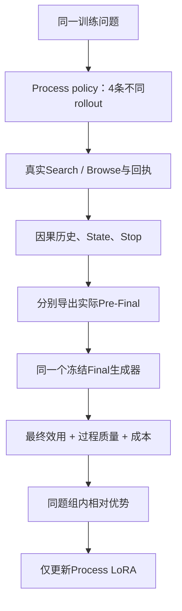

# Process-only GRPO：下一阶段计划

[版本说明](README.md) · [正式四组评测](evaluation.md) · [返回首页](../../README.md)

本页是待执行协议，不代表已经完成Process-only GRPO。先以开发集选择Final，再冻结生成器、输入合同和reward；独立测试题不用于RL更新或反复挑参数。

## 可训练边界



Qwen3-8B base冻结；Process LoRA可训练；Final LoRA（若采用）及Final base都冻结。Final token不进入policy loss；冻结也不能仅靠不计Final loss实现，必须排除Final adapter参数，并确认更新前后其hash不变。可共用base并切换adapter，但KV cache必须清空、按Final输入重新prefill。

## 精度、行为概率与数据身份

SFT的QLoRA adapter可作初始化；GRPO优先使用匹配的BF16 frozen base + Process LoRA进行rollout和replay，不将BF16采样与NF4 / k-bit prepare重放混合。adapter dtype、attention、模板、thinking、上下文、位置、特殊token和采样过滤配置一并冻结。

每批先冻结old policy snapshot，再从它采样；保存生成token、输入token、有效策略跨度、行为logprob、工具回执及模型/源码身份。old policy与KL reference不是同一个概念；reference用于约束漂移，old snapshot用于本批ratio。概率取原始模型分布还是采样变换后的分布，必须一致定义和验证，不能混用。

更新前用同一snapshot重放短/长真实Process样本，检查逐tokenlogprob差、mask、数据位置和比率。parity不通过先修数值路径，不通过放宽容差掩盖不一致。Final不需要参与Process logprob重放，但其生成配置、输入与输出须可审计。

## Rollout与奖励

初版每题4条Process rollout，Process T=1用于探索。下游Final使用同一冻结checkpoint和低随机性配置，降低相同证据信息被随机生成不同答案造成的reward噪声；该设置独立于正式T=1对照实验。固定seed本身不保证跨数值路径确定性。

奖励候选为最终任务效用、证据增益、State忠实性、合法停止与工具成本。先冻结rubric、权重、归一化和失败处理，再开训：

- Final效用衡量Process交给固定生成器的信息是否有用，不反向更新Final。
- 证据增益以实际新文本对原问题的支持为准，不奖励来源数量、字符串新颖或自报 `direct`。
- State检查实体、数字、终点与引用对应；自行将unknown升级direct不自动得到正奖励。
- Stop检查未解决缺口、预算和继续搜索预期收益；环境访问失败不等于任务已无证据。
- 成本按真实回执结算，区分计费动作、环境失败豁免、非法动作与无收益重复；不双重扣同一失败。

先验证final-only reward基线，再研究附加过程reward的独立收益，避免未经校准的多个分数互相重复。HealthBench式rubric可作效用设计参考，但正式测试20题及其评测反馈不进入训练；训练reward需使用独立训练问题和冻结规则。

## 计划目标函数与算法

### 固定生成器下的奖励

对问题 $q$，从同一冻结old Process snapshot采样 $G=4$ 条轨迹 $\tau_i$。实际输入导出器 $g$ 与冻结Final生成器 $f_\phi$ 形成：

```math
z_i=g(q,\tau_i),\qquad y_i=f_\phi(z_i).
```

计划reward为：

```math
R_i=\lambda_F R_F(q,y_i)
+\sum_{c\in\mathcal C_P}\lambda_c R_c(q,\tau_i)
-\eta C(\tau_i),
```

其中过程通道集合为Checklist、Search、Browse、Evidence Gain、State、Stop；C是按回执核实的成本，λ与η在开训前冻结。先做仅终局效用的基线：λ_F=1、各过程λ_c=0；增加过程reward是单独消融，不预报正收益。Final本身不获得梯度。

### 组内相对优势

初版计划沿用可解释的leave-one-out baseline，不默认按组内标准差缩放：

```math
b_i=\frac{1}{G-1}\sum_{j\ne i}R_j,\qquad
A_i=R_i-b_i.
```

有效组内reward完全相同时A_i=0，按约定记录零信号并跳过更新。缺失judge/不可复算reward不是0分；环境失败的有效性与失败reward先明确规则，保留失败记录，不按分数删轨迹。若后续采用group-std-normalized优势，另作算法变量冻结与对照。

### 策略目标与mask

令 $T_i^P$ 为Process真实生成的策略token集合，$h_{it}$ 包含此前真实历史及工具Observation，但只有 $T_i^P$ 进入loss。比率：

```math
\rho_{it}(\theta)=
\frac{\pi_\theta(a_{it}\mid h_{it})}
{\pi_{\mathrm{old}}(a_{it}\mid h_{it})}.
```

为避免长公式挤在一行，先定义clipped项 $s_{it}$ 与reference-KL项 $K_{it}$，再写同一个目标：

```math
\begin{aligned}
s_{it} &= \min\!\left(\rho_{it}A_i,
\operatorname{clip}(\rho_{it},1-\epsilon,1+\epsilon)A_i\right), \\
K_{it} &= D_{\mathrm{KL}}\!\left(
\pi_\theta(\cdot\mid h_{it})\Vert\pi_{\mathrm{ref}}(\cdot\mid h_{it})\right), \\
J(\theta) &= \frac{1}{G}\sum_{i=1}^{G}\frac{1}{|T_i^P|}
\sum_{t\in T_i^P}\left[s_{it}-\beta K_{it}\right].
\end{aligned}
```

训练最小化−J。θ只包含Process LoRA；base、Final、输入历史与证据均无训练梯度。old为本批行为snapshot，ref为冻结参考策略，不能混为同一个角色。β≥0是计划的可选reference-KL项；β=0时只保留clipping与漂移监测。reference-KL尚未在此版本验收，不能借历史target-KL早停声称已经实现。

初版把同一A_i赋给该轨迹的所有有效Process token；细粒度版再以真实capture对应的通道A_ic替换，按通道权重归一化。两种信用分配是待比较算法，不在同一实验中悄悄切换。ε、β、学习率、组batch与更新轮数在小批验收后冻结。

### 单批训练流程

1. 冻结old snapshot、ref、Final、reward与源码身份。
2. 同题采样4条Process轨迹，保存输入、动作token、行为logprob、工具回执及State。
3. 分别导出实际Pre-Final，调用同一冻结Final，复算reward并构造A_i。
4. 同snapshot replay先通过逐token概率parity，再按策略mask计算−J。
5. optimizer只更新Process LoRA；监测ratio、clip fraction、KL、reward方差、零优势比例、梯度与访问成本。
6. 保存完整续跑状态；结束后冻结checkpoint，用独立测试集作配对评价。

工具环境不要求可微；梯度经过动作logprob，而不反向穿过Search、Browse、Final或judge。

## 优势与归因约束

同题内部按上面的leave-one-out公式计算相对优势。组内分数相同则没有相对排序信号，按约定零优势/跳过并记录比例，不无限重采直到出现满意分数。组大小、有效题数、失败rollout、token长度及reward方差一起报告。

只对Process生成的Checklist、Decision、State、Stop策略token计算clipped policy objective；Question、Prompt、历史、工具结果、证据和Frozen Final全部mask。终局效用先作用于整条Process；更细的阶段归因需明确映射到实际capture跨度，不能按邻近token猜测。KL系数、clip范围、学习率、batch和更新次数待小规模验收后冻结，本页不借用SFT参数冒充已确定RL配置。

## 开训 gate、保存与评价

1. 检查真实工具、预算和因果历史；确认Final输入来自该rollout而非teacher理想证据。
2. rollout/replay parity通过；检查仅Process参数有梯度且实际更新，base与Final均未变化。
3. 完成一个真实组的小更新：reward可复算、无未来/target泄漏、无NaN、无失控重复。
4. 保存Process adapter、optimizer、scheduler、RNG、数据位置、old/reference身份、冻结Final身份、reward配置和源码hash；做fresh-process续跑测试。
5. 冻结训练checkpoint后，在独立题上做同工具预算的Base / SFT / GRPO比较；同时报告官方rubric口径的替代grader评分与项目多维度审核。

GRPO是否提升证据获取、State和停止，以及是否在固定Final下提升答案，须由上述对照验证；不预报正结果。
