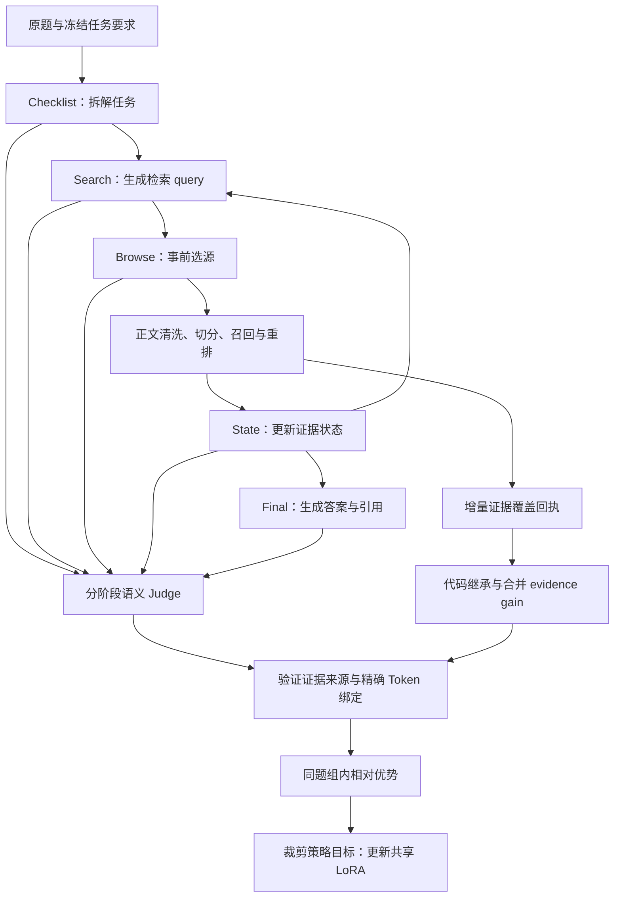

> 历史版本说明：以下正文保留首页重组前的单 LoRA 方法、实验与配置。文中的“当前”指该历史版本，不是最新检索。该版本使用 [冻结旧检索](../legacy_retrieval/README.md)；[返回新版首页](../../README.md)。

# 医学研究智能体｜Qwen3-8B SFT 与分阶段稠密奖励 GRPO

## 版本动机

这是全链路学习的初始路线：在同一套 LoRA 上学习 Checklist、检索决策、证据状态与 Final，先建立真实工具使用、工程格式和证据引用的共同基线。分阶段评测用于定位薄弱环节，而不仅看最终答案总分。

后续迭代关注多阶段共用参数时的任务耦合：检索改进不必然转化为 Final 的忠实综合，因此需要进一步分离 Process 与 Final 的优化和验证。本版本的方法与实验保留在下文，后续版本的参数和结果不回填到这里。

## 题池来源、监督与拆分

早期使用经筛选、去重的医学研究问题池，最终保留1,053条轨迹：974 train、79 dev。题池整理的公开资料来源与题目本身的构建来源应分开溯源；现有早期清单包含模型生成与去重记录，因此不能把全部题目标成从GitHub或网上原样下载的官方题。公开资料、来源发现和人工筛选不等于每道题都有一个固定正确答案。

本版本通常没有逐题唯一的最终答案金标，训练监督来自teacher全链路completion；隐藏需求、rubric等评测依据与teacher可见输入分开。后续972题清洗包是另一个版本，不回填成早期974题的同一统计。

每个阶段保留自己的输入前缀，仅监督当前 Checklist、Decision（Search/Browse）、State、Stop或Final输出；此前历史与真实工具结果只作条件输入。[训练实现](../../sft/train_tc2.py)先将一条样本的有效target CE取token均值，再乘 `sample_weight`，effective batch 内按样本聚合。不是把完整输入、工具回执和所有历史token一起训练，也不是独立Final版本的跨样本token均值。

面向本地部署的医学 Research Agent：基于 Qwen3-8B，自主调用 Search/Browse 工具，检索医学证据、更新任务状态，并生成带来源引用的回答；通过 QLoRA SFT 和分阶段稠密奖励进行 GRPO 风格后训练。

项目重点不是给模型接一个检索接口，而是研究：**如何让真实工具轨迹中的检索、选源、证据判断和最终回答分别获得学习信号。**

| 当前冻结数据切分 | 规模 |
|---|---:|
| SFT Train | 974 |
| SFT Dev | 79 |
| GRPO 医学问题池 | 500 |
| GRPO Train | 450 |
| Base / SFT 配对留出评测 | 50 |

50 题留出集不参与参数更新，并固定用于 Base → SFT → GRPO 的配对比较。

## 50 题 Base / SFT 真实配对评测

在同一 Qwen3-8B backbone、同一评测 Runtime 与冻结题集下，SFT 取得 **36 胜、10 负、2 平、2 个双方失败平局**；严格端到端通过率由 Base 的 **41/50** 提升到 SFT 的 **43/50**。在双方端到端均有效的 36 对样本中，冻结综合均分为 Base **64.36**、SFT **81.42**。

评测由 **ChatGPT Pro** 按冻结规则逐题审核，并使用 Codex 文件审计流程核对问题、工具回执、已打开证据、State 与正式 Final。模型标签对评审可见，因此不声称盲评；该分数衡量本项目协议和证据约束下的综合表现，不等同于临床正确率。

[查看完整 50 题结果、评分规则与逐题分数](../../docs/evaluation/local50_raw_sft_chatgpt_pro_20260923.md)。公开表格直接给出冻结 rubric 的加权综合分，不再另设展示上限；最高档表示在本次离散规则下达到该档位，不等同于绝对医学正确。

## SFT与GRPO公式

### 全链路step-wise SFT

一条样本只监督当前阶段；训练阶段集合为Checklist、Decision、State、Stop、Final。设 $T_i$ 为样本 $i$ 的有效target位置，$a_i$ 为sample weight，batch为 $B$，则公开训练器的loss为：

```math
\mathcal L_{\mathrm{single}}(B)=
\frac{1}{|B|}\sum_{i\in B}a_i
\frac{1}{|T_i|}\sum_{t\in T_i}
-\log\pi_\theta(y_{it}\mid x_i,y_{i,\lt t}).
```

先对样本内target取token均值，再按样本权重聚合。不同阶段通过其样本与权重贡献loss，不对输入、历史、工具回执重复监督。所有阶段更新同一套LoRA。

### 现有分通道相对优势

同一问题采样 $G$ 条轨迹，通道 $c$ 的局部分数为 $u_{ic}$，最终任务分数为 $F_i$。公开compiler使用leave-one-out baseline：

```math
\begin{aligned}
A^{\mathrm{local}}_{ic}
&=u_{ic}-\frac{1}{G-1}\sum_{j\ne i}\bar u_{jc}, \\
A^{\mathrm{final}}_i
&=F_i-\frac{1}{G-1}\sum_{j\ne i}F_j.
\end{aligned}
```

```math
A_{ic}=\lambda^{\mathrm{local}}_c A^{\mathrm{local}}_{ic}
+\lambda^{\mathrm{final}}_c A^{\mathrm{final}}_i.
```

局部baseline使用其他轨迹同通道的均值；Tool/Stop按决策位置对齐，并使用由该位置向后的task return，而非将所有步混成一个baseline。未观测reward不当作0分，关键评分缺失须先补齐或拒绝编译。上式G表示该项有可比较评分的有效轨迹数。

### 精确token归因与clipped objective

令 $S_{ic}$ 为通道对应的实际输出token索引，$\kappa_{ic}$ 为通道loss权重（按该轨迹通道记录数分摊），行为snapshot为old：

```math
\rho_{it}=\exp\!\left(
\log\pi_\theta(a_{it}\mid h_{it})
-\log\pi_{\mathrm{old}}(a_{it}\mid h_{it})
\right),
```

```math
\mathcal L_{\mathrm{RL}}
=-\frac{1}{\sum_{i,c}\kappa_{ic}}
\sum_{i,c}\frac{\kappa_{ic}}{|S_{ic}|}
\sum_{t\in S_{ic}}
\min\!\left(\rho_{it}A_{ic},
\operatorname{clip}(\rho_{it},1-\epsilon,1+\epsilon)A_{ic}\right).
```

这是现有GRPO风格分通道策略更新，不把它称作标准group-std-normalized GRPO。行为概率必须按同一采样分布重放；索引来自capture，不包含输入或Observation。代码另外监测：

```math
\widehat D_{\mathrm{old,current}}
=\operatorname{mean}_t\!\left(\rho_{it}-1-\log\rho_{it}\right).
```

该量用于漂移监测和target-KL早停，不能冒称已有训练器同时实现了reference-KL惩罚。源码见[compiler](../../training/core.py)、[clipped loss](../../training/policy_loss.py)、[训练器](../../training/train.py)。完整工程验收与真实训练效果分别登记。

## 为什么从 SFT 转入策略优化

本项目把 SFT 定位为 Agent 的 cold-start 阶段：先让 Qwen3-8B 学会任务拆解、Search/Browse 工具协议、Evidence State 更新、停止决策和引用式回答。50 题留出评测显示，SFT 已经显著改善完整 Agent 轨迹生成与严格端到端通过能力，能够稳定产生可用于在线策略优化的真实工具 rollout。

剩余错误更多是**同一状态下的动作质量与长轨迹信用分配**问题，例如选择相关但低价值的来源、重复 Browse 却没有新增 Evidence Gain、把 partial evidence 误判为 direct、停止时机不理想，以及 Final 对证据的过度推断或偶发重复。这些问题不只是缺少更多正确示范，还需要比较同题多条轨迹中不同动作的相对价值。

因此项目冻结当前 SFT checkpoint 作为初始化策略，转入基于真实工具 rollout 的 GRPO：用 Checklist、Search、Browse、Evidence Gain、State、Stop 与 Final 的分阶段反馈继续优化共享 LoRA。这不表示 SFT 已达到理论最优，而是表示它已经完成当前阶段作为 RL 初始化策略的主要职责。

## 为什么不只奖励最终答案

只看最终答案总分时，很难区分“检索词有效”“选错来源”“证据判断错误”和“答案引用不支持主张”。本项目保留最终任务收益，同时拆分过程奖励，将不同通道的优势绑定到实际生成的 Token 范围。

| 算法设计 | 解决的问题 |
|---|---|
| 分阶段信用分配 | Checklist、Search、Browse、State、Final 分别评价，而非所有动作只接收同一个总分 |
| 选源与证据收益分离 | Browse 评价打开前的选源质量；代码根据打开后的 coverage 回执计算 evidence gain |
| 增量证据继承 | 保留上一步可信证据状态，评价新证据增量，避免无关新材料抹掉已确认支持 |
| 精确 Token 归因 | 评分绑定真实 record/capture，再编译到对应生成跨度，不按“附近 Token”猜测归属 |
| 组内相对优势 | 同题多条 rollout 按冻结配置计算 advantage，使用 clipped objective 更新共享 LoRA |

以上是已实现的设计，不代表已通过消融实验证明优于 final-only 奖励。

## 系统架构



## 真实轨迹案例

急性冠脉综合征后的秋水仙素研究问题，来自服务器实际 SFT 推理记录：

```text
英文医学原题
→ Checklist：拆成疗效与治疗限制性不良反应两个要求
→ Search：检索相关论文
→ Browse：打开 S2 论文来源，读取带完整 ID 的正文片段
→ State：模型将两个要求均标记为 direct
→ FINAL_READY
→ Final：四段英文答案，生成四个句后 citation
```

本例实际执行 **1 次 Search、1 次 Browse**，没有补造第二轮检索。[查看真实原始输出、工具动作与引用](../../examples/trajectory_demo/README.md)。这是过程案例，不是标准答案：State 是模型自报状态，治疗限制性不良反应是否充分回答仍需原文审核。本例未调用 Judge，奖励字段保留为 null。

## 已验证的范围

| 内容 | 当前证据与边界 |
|---|---|
| 真实工具轨迹 | 独立服务器实验执行真实 Search/Browse，并保存生成 capture 与工具执行记录 |
| 分阶段 Judge | 一题四轨迹的阶段评分完成；合法 schema 不等于语义判断一定正确 |
| 增量 evidence gain | 四轨迹、8 个 Browse 的收益评分通过，实际 6 次 API 请求、6 次缓存命中 |
| 奖励编译与绑定 | 可信 authority 与 batch preflight 通过，共编译 42 条通道记录 |
| 行为概率一致性 | 同一工程验收的 replay 最大差值约为 7.39×10⁻⁶ |
| 真实 LoRA 更新 | 一题四轨迹执行 1 次 optimizer.step；504 个权重张量改变，checkpoint 完整性通过，原适配器不变 |
| 无模型离线检查 | 250 项核心合同回归检查；另有 Python 3.10 / 3.11 / 3.12 CI |
| Base / SFT 留出评测 | 50 题冻结配对评测：SFT 36 胜、Base 10 胜、2 平、2 个双方失败平局 |

表中工程验收与上面的 SFT 案例是不同运行，不能把工程验收奖励归到该案例。

## 训练路线

SFT 学习工具协议和多步轨迹；RL 使用真实工具采集结果及局部奖励继续更新同一共享 LoRA。模型权重不合并为新的完整模型后再重复叠加适配器；具体加载与概率校验见[训练说明](../../docs/training.md)。

训练与集成验证运行于新加坡 NSCC GPU 集群，兼顾单卡 QLoRA 与本地推理部署。当前已验收的 RL 参数更新是单 GPU 实验；共享阶段上下文上限为 **8192 tokens（输入＋预留输出）**，Final 单次输出上限为 **2400 tokens**。

```text
固定当前策略 → 采集多条真实轨迹 → 分阶段 Judge → ChatGPT Pro 语义复核
            → 可信奖励编译 → 概率与绑定校验 → LoRA 训练 → 留出集对照
```

计划以 50 题、每题 4 条 rollout（共 200 条轨迹）为一个采集与评分周期。复核纠正需要保留原响应、审核依据和版本化回执，不能直接改 batch 分数。

**一个采集周期不等于一次 optimizer.step。** 采集/评分批次与参数更新分别记录，避免把“收集了 50 题”误写成“只执行了一次大批量更新”。

## 检索与证据处理

工具后端接入 PubMed/PMC、Semantic Scholar 与网页检索；正文经过 HTML/XML 解析、通用模板噪声过滤和多语言边界切分，再进行 BM25/BGE 召回与 MiniLM 重排。

Browse 返回完整 chunk ID 与正文，State 保存 requirement 对应的 evidence IDs，Final 自己生成正文及句后 `<cite>`。代码检查格式与 ID，Judge 判断语义支持；不会自动替模型补上引用。详见[检索说明](../../docs/retrieval.md)。

最近一次工程同步补齐了 `structure_kind / boundary_incomplete / table_integrity_verified` 从 Browse 到 State/Final 的无损传递：普通统计正文不会因出现 RR/CI 被误判为表格；完整表格可引用，残缺表格保留 provenance 但不进入可引用证据。低于 8K 合同预算时仍使用完整上下文，只有超限时才按原始证据卡与不可引用预算回执降级。Final 的重复检测只负责异常停止并保留原始输出，不修改 logits，也不自动重写答案。详见[近期工程同步](../../docs/recent_engineering_updates.md)。

## 核心模块

| 模块 | 实现内容 |
|---|---|
| 模型与后训练 | Qwen3-8B 接口，completion-only QLoRA SFT，共享 LoRA RL trainer |
| 检索与证据 | HTML/XML 解析、通用模板噪声过滤、多语言切分边界、BM25/BGE 召回与 MiniLM 重排 |
| Agent 协议 | Checklist 原题锚点、预算化候选预览、证据卡、State evidence IDs、Final citation 与重复终止审计 |
| Judge | Checklist、Search、Browse、State，以及 Final completeness / fidelity / citation |
| 任务收益 | 增量证据覆盖、工具成本、可信 policy event 与可评价的主动 Stop |
| 训练完整性 | 可信 authority、真实 capture/token 绑定、整题组 pending gate、原子 checkpoint |

公开仓库是当前项目的**脱敏源码导出**，不是服务器目录的逐字节镜像。它同步算法模块、工具后端、训练器、近期证据完整性/预算/重复保护代码、真实轨迹摘录与离线测试；模型权重、私有题集、完整 capture、密钥和集群专用脚本不随代码发布。

## 外部 API 与用途

离线演示和合同测试不需要 API Key；本地 Qwen3-8B / LoRA 推理也不依赖云端生成 API。真实联网流程按启用能力配置：Serper 用于通用网页候选发现，PubMed/PMC 与 Semantic Scholar 用于医学文献检索，MinerU 只在 PDF 正文解析路径启用，OpenAI-compatible Judge endpoint 用于轨迹采集后的分阶段语义评分。MedGap verifier、Jina、Crawl4AI 与 semantic evidence reader 均为可选后端。

公开配置模板只保留变量名，不包含真实值：

```text
Web Search          SERPER_API_KEY
PubMed / PMC        NCBI_API_KEY（可选）
Semantic Scholar    S2_API_KEY（可选）
PDF / MinerU        MINERU_API_TOKEN 或 MEDGAP_MINERU_BASE_URL（可选）
Stage Judge         JUDGE_BASE_URL / JUDGE_MODEL / JUDGE_API_KEY
Semantic Verifier   MEDGAP_VERIFIER_* + DASHSCOPE_API_KEY（可选）
```

每项服务何时调用、无 Key 时如何降级及对应源码位置见[外部 API 配置说明](../../docs/apis.md)。不要提交本地 `.env` 或在日志中打印任何密钥。

## 零 GPU、零 API Key 演示

Python 3.10+ 即可运行：

```bash
python -B run_pipeline.py demo
python -B run_pipeline.py check
```

演示用明确标记的合成四轨迹 fixture 调用**实际 reward compiler**，验证正负 advantage 和增量证据继承。不会加载模型、请求 Judge 或更新参数；fixture token IDs 不代表真实模型 capture。

离线检查覆盖奖励、authority、证据回执、Judge schema 与整组放行规则。

## 代码结构

```text
agent/          模型可见协议、citation 与 token 工具
retrieval/      工具后端、正文解析与片段选择
sft/            completion-only QLoRA 数据准备与训练
judge/          评分计划、schema 验证与维度聚合
shared/         不可变回执、evidence gain 与严格缓存
training/       reward compiler、advantage、clipped loss 与 replay
orchestrator/   可移植身份、token scope 与执行工具
examples/       真实静态轨迹案例与无密钥离线验证
docs/           中文架构、算法与训练说明
```

按功能定位当前源码，请看[代码阅读导航](../../docs/code_navigation.md)。GPU 训练依赖与输入准备见[训练说明](../../docs/training.md)。

## 当前研究边界

当前公开效果结论以 50 题 Base/SFT 冻结配对评测为准。离线合同测试、工具成功和流程完成分别证明不同层面的工程行为，不能互相替代；医学内容结论仍需结合逐题证据审核理解。

## 阅读导航

| 文档 | 内容 |
|---|---|
| [系统架构](architecture.md) | 工具轨迹、证据流与可信训练边界 |
| [奖励算法](../../docs/rewards.md) | 局部奖励、evidence gain、优势与归因 |
| [检索与正文处理](retrieval.md) | 正文清洗、切分、召回、重排与证据坐标 |
| [SFT 与 RL 训练](../../docs/training.md) | 模型加载、LoRA、行为概率 replay 与更新 |
| [评测与独立复核](../../docs/evaluation.md) | 对照实验、Judge 审计与结果使用边界 |
| [50 题 Base/SFT 评测](../../docs/evaluation/local50_raw_sft_chatgpt_pro_20260923.md) | ChatGPT Pro 冻结评测、汇总指标与逐题结果 |
| [近期工程同步](../../docs/recent_engineering_updates.md) | 表格完整性、结构字段、预算回执与重复保护 |
| [外部 API 配置](../../docs/apis.md) | Serper、PubMed、Semantic Scholar、MinerU、Judge 与可选语义服务 |
| [代码阅读导航](code_navigation.md) | 当前入口、版本模块依赖与推荐阅读顺序 |

## 开源与使用边界

Apache-2.0；复用代码的必要署名见[第三方声明](../../THIRD_PARTY_NOTICES.md)。模型和外部服务另受各自条款约束。许可证原文与必要版权声明保留。

本项目用于研究，不作为医疗决策系统。
